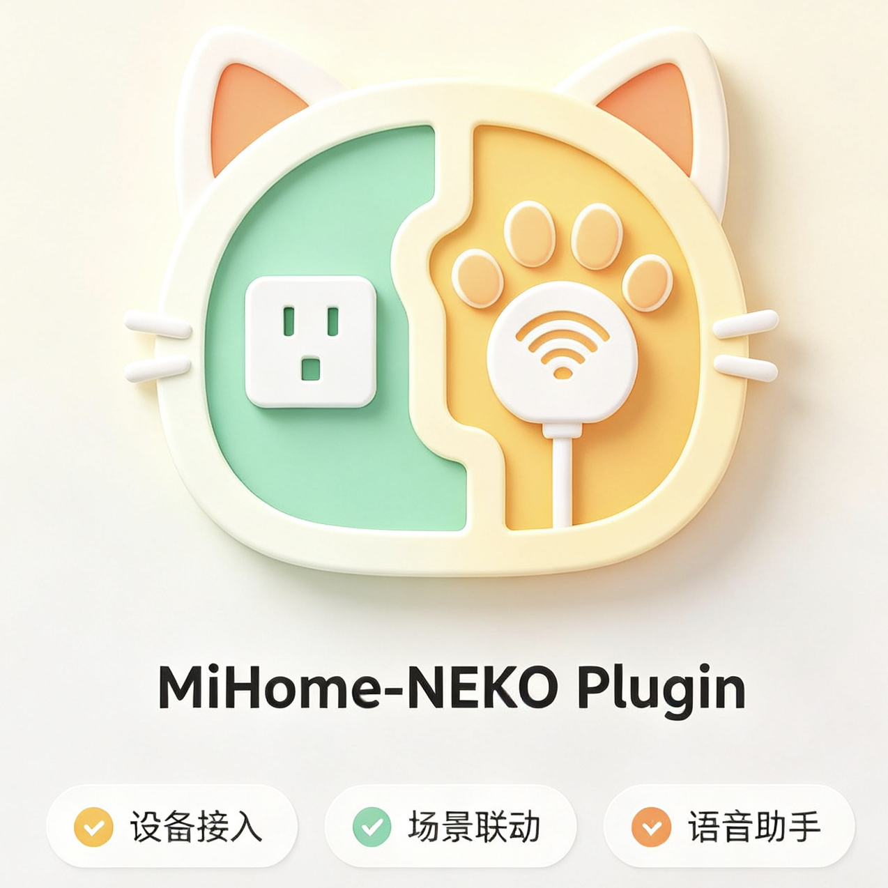

<p align="center"></p>

# 米家智能家居插件

基于小米 MiOT 协议，通过 N.E.K.O AI 控制米家智能设备。

---

## 功能概览

| 能力 | 说明 |
|------|------|
| 账号登录 | 扫码登录小米账号，凭据本地安全存储（文件权限保护） |
| 设备发现 | 获取家庭下全部设备，自动缓存规格信息 |
| 智能控制 | 自然语言一句话开关设备 |
| 状态查询 | 批量读取设备所有可读属性 |
| 精确控制 | 按 siid/piid 写入任意属性值 |
| 操作调用 | 触发扫地、播放等预定义 Action |
| 场景联动 | 执行米家 App 中预设的智能场景 |

---

## 快速上手

### 第一步：登录

首次使用需扫码登录小米账号：

1. 启动 N.E.K.O，插件会自动打开配置页面
2. 或手动访问：`http://localhost:48916/plugin/mijia/ui/`
3. 扫描页面上的二维码，完成授权
4. 登录成功后凭据自动保存，重启不需要重新登录

### 第二步：获取设备

登录后告诉 AI 获取设备列表，AI 会自动缓存全部设备信息（含属性/操作规格）：

> "帮我列一下米家的设备"

### 第三步：开始控制

直接对 AI 说指令即可：

> "打开客厅插座"  
> "把台灯关掉"  
> "查一下空调现在的状态"

---

## 入口说明

### `smart_control` — 智能控制设备

自然语言控制设备开关，自动完成"查找设备 → 识别开关属性 → 执行控制"全流程。

**支持的关键词**

| 操作 | 关键词 |
|------|--------|
| 开 | 打开、开启、开 |
| 关 | 关闭、关掉、关 |

**示例**
```python
smart_control(command="打开客厅插座")
smart_control(command="关闭灯")
```

**注意**
- 命令必须包含设备名，如"打开"（缺设备名）会报错
- 自动匹配的开关属性优先级：名称含"开关/电源/power/switch"的可写属性 > 第一个可写 bool 属性
- 如果设备没有可写开关属性，请改用 `control_device` 精确控制

---

### `query_device_state` — 查询设备状态

按名称查询设备所有可读属性的当前值，是最常用的状态查询入口。

**示例**
```python
query_device_state(name="插座")
```

**返回示例**
```text
📱 设备 '插座' 当前状态：

  • 开关: ✅ 开启
  • 功率: 1250
  • 电压: 220
```

---

### `find_device_by_name` — 根据名称查找设备

从缓存中模糊匹配设备，返回设备完整信息（did、properties、actions 等）。

控制设备前，AI 通常需要先调用此入口获取 `did`、`siid`、`piid`。

**示例**
```python
find_device_by_name(name="插座")
```

---

### `get_cached_devices` — 获取缓存的设备列表

从本地缓存读取全部设备，无网络请求，速度快。缓存不存在时自动触发 `list_devices`。

**参数**
- `refresh=true`：忽略缓存，重新从服务器拉取

---

### `list_devices` — 获取设备列表

从服务器拉取最新设备列表，同时为每台设备请求 MiOT 规格（属性/操作），写入本地缓存。

**参数**
- `home_id`：指定家庭，留空时自动使用第一个家庭
- `refresh=true`：强制刷新，忽略现有缓存

**注意**：此入口耗时较长（需逐一获取规格），建议只在设备有增减时调用。日常查询用 `get_cached_devices`。

---

### `list_homes` — 获取家庭列表

列出账号下所有米家家庭及 ID。`list_devices` 需要 home_id 时可先调用此入口。

---

### `control_device` — 控制设备属性

直接向设备写入属性值，适合需要精确控制特定属性的场景（亮度、色温、定时等）。

**参数**
- `device_id`：设备 did，从 `find_device_by_name` 返回的 `devices[].did` 获取
- `siid`：服务 ID，从设备信息的 `properties[].siid` 获取
- `piid`：属性 ID，从设备信息的 `properties[].piid` 获取
- `value`：目标值，类型须与属性 type 一致（bool/int/float/string）

**示例：把台灯亮度设为 80**
```python
# 1. 查找设备
find_device_by_name(name="台灯")
# → devices[0].did = "xxx", properties 中找到亮度: siid=2, piid=3

# 2. 写入属性
control_device(device_id="xxx", siid=2, piid=3, value=80)
```

---

### `get_device_status` — 获取设备单个属性值

读取设备的某一具体属性值。适合只需查询某个特定属性（不需要全量状态）的场景。

**参数**：`device_id`、`siid`、`piid`（均从设备信息中获取）

---

### `get_device_spec` — 获取设备规格

查询设备型号的 MiOT 规格，列出全部可控属性和可调用操作，帮助 AI 了解设备能力边界。

**参数**：`model`，设备型号字符串，如 `cuco.plug.v3`，从 `get_cached_devices` 返回的 `devices[].model` 获取。

**返回内容**
- `properties`：属性列表（siid、piid、name、type、access、value_range）
- `actions`：操作列表（siid、aiid、name、parameters）

---

### `call_device_action` — 调用设备操作

触发设备的预定义 Action，如扫地机开始清扫、音箱播放音乐等。

**参数**
- `device_id`：设备 did
- `siid`：服务 ID（从 `get_device_spec` 的 `actions[].siid` 获取）
- `aiid`：操作 ID（从 `get_device_spec` 的 `actions[].aiid` 获取）
- `params`：操作参数（可选，部分 Action 无需参数）

---

### `execute_scene` — 执行智能场景

触发在米家 App 中创建的智能场景（如"回家模式"、"睡眠模式"）。

**参数**
- `scene_id`: 场景 ID
- `home_id`: 家庭 ID

**获取 scene_id**：目前需通过米家 App 查看或抓包获取，插件暂不提供场景列表入口。

**示例**
```python
execute_scene(scene_id="123456", home_id="abcdef")
```

---

### `logout` — 登出

清除本地凭据文件和所有缓存数据（`data/` 目录），退出登录状态。

---

## 数据文件

所有数据保存在插件的 `data/` 目录下：

| 文件 | 内容 | 说明 |
|------|------|------|
| `credential.json` | 登录凭据 | 权限 600，仅当前用户可读 |
| `devices_cache.json` | 设备列表及规格缓存 | 包含 did、properties、actions、user_id、home_id（归属校验用） |

### 缓存结构（devices_cache.json）

```json
{
  "home_id": "xxx",
  "user_id": "xxx",
  "devices": [
    {
      "did": "设备唯一ID",
      "name": "设备名称",
      "model": "设备型号",
      "is_online": true,
      "room_id": "房间ID",
      "properties": [
        {
          "siid": 2,
          "piid": 1,
          "name": "开关",
          "type": "bool",
          "access": "read_write",
          "value_range": null,
          "value_list": null
        }
      ],
      "actions": [
        {
          "siid": 2,
          "aiid": 1,
          "name": "开始清扫"
        }
      ]
    }
  ]
}
```

---

## 属性权限说明

`properties[].access` 字段含义：

| 值 | 说明 |
|----|------|
| `read` | 只读，可查询不可写入 |
| `write` | 只写，可写入不可查询 |
| `read_write` | 读写，可查询和写入 |
| `notify` | 事件通知 |
| `notify_read` / `notify_read_write` | 含通知的读/读写属性 |

---

## 常见问题

**Q：控制命令无效，提示"没有可控制的开关"**  
A：该设备可能不支持简单开关控制，请用 `get_device_spec` 查看完整属性列表，再用 `control_device` 精确控制。

**Q：设备不在线**  
A：请检查设备电源和网络，或尝试重启设备。离线设备的控制请求会被服务器拒绝。

**Q：凭据过期**  
A：插件每天自动检查凭据有效期，临近过期时自动续期。若自动续期失败，请重新扫码登录。

**Q：设备列表不更新**  
A：调用 `get_cached_devices(refresh=true)` 或 `list_devices(refresh=true)` 强制刷新。

**Q：`list_devices` 太慢**  
A：正常现象，首次获取需为每台设备单独请求 MiOT 规格，设备越多越慢。建议只在设备变更时调用一次，日常使用缓存即可。

---

## 返回格式

所有入口均返回包含 `message` 字段的标准格式，AI 可直接读取 `message` 向用户展示。

```python
# 成功
{
    "success": True,
    "message": "✅ 已打开'插座'",
    ...其他字段
}

# 失败（返回 Err，AI 会收到错误信息）
Err(SdkError("设备离线"))
```

### Emoji 图例

| 图标 | 含义 |
|------|------|
| ✅ | 操作成功 / 属性开启 |
| ❌ | 操作失败 / 属性关闭 |
| 🟢 | 设备在线 |
| 🔴 | 设备离线 |
| 📱 | 设备 / 状态 |
| 📊 | 单个属性值 |
| 📋 | 规格信息 |
| 🏠 | 家庭 |
| 🔍 | 搜索结果 |
| ▶ | 操作 |
| 🔘 | 可写属性 |
| 👁 | 只读属性 |

---

## 依赖

- Python 3.11+
- 内嵌 `mijia_api` 模块（不用单独下载）
- 外部依赖见项目根目录 `requirements.txt`
