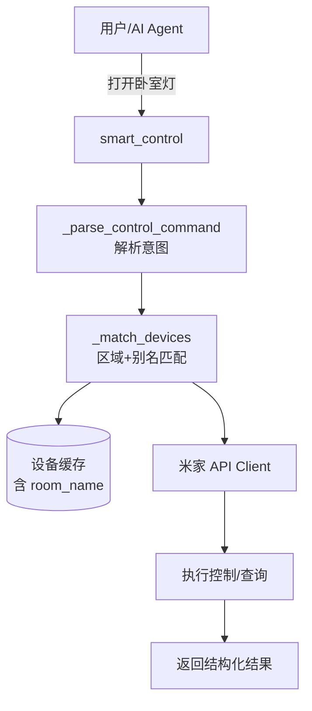

# Mijia Plugin for Neko (米家智能家居插件)

[](https://example.com)
[](https://www.python.org/)

这是一个为 **Neko 智能体平台**设计的米家（Mijia）插件，旨在通过**自然语言**无缝接入庞大的米家生态。用户无需记忆复杂的设备 ID 或技术参数，只需像和朋友聊天一样发出指令，即可实现对家中智能设备的精准控制。

## ✨ 核心特性 (What's New)

### 🧠 智能语义解析 (Smart NLP Parsing)
插件内置了强大的自然语言理解引擎，能够解析多样化的口语指令，无需严格语法：

| 指令类型 | 示例指令 (User Query) | 解析逻辑 |
| :--- | :--- | :--- |
| **基础开关** | `打开卧室灯` <br> `关掉客厅插座` | 支持动词前置，自动识别设备主体 |
| **区域+设备** | `卧室的灯` <br> `客厅空调` | **（本次更新重点）** 支持拆分房间名与设备名 |
| **属性调节** | `灯调到50%` <br> `空调26度` | 自动识别数值与单位，映射到对应属性 |
| **模式切换** | `空调调制冷` <br> `风扇调自动` | 支持中文模式词直接映射 |
| **场景执行** | `执行回家模式` | 兼容"执行"、"运行"、"触发"等动词 |

### 🏠 空间感知与消歧 (Spatial Awareness & Disambiguation)

*   **区域感知**：插件会自动构建 `room_id -> room_name` 映射，理解"客厅"、"主卧"等空间概念。
*   **优雅消歧**：当用户指令（如"打开灯"）匹配到多个设备时，插件**不再报错**，而是返回结构化的澄清选项：
    > 找到 3 个匹配 '灯' 的设备：
    > 1. 🟢 客厅 吸顶灯
    > 2. 🔴 卧室 吸顶灯
    > 请用房间名+设备名精确指定，如 '卧室灯'

### 🔒 安全与稳定
*   **凭据隔离**：严格校验用户 ID 和家庭 ID，防止多账户环境下的缓存数据泄露。
*   **自动刷新**：内置 Token 自动刷新机制，避免频繁登录。
*   **本地缓存**：设备列表和设备规格本地缓存，大幅降低 API 调用延迟。

## 🚀 快速开始

### 1. 安装与配置
确保你的 Neko 插件环境已就绪，并将本插件放入 `plugins` 目录。

### 2. 登录米家账号
插件支持 **扫码登录**，这是最安全的方式：

```json
// 第一步：获取二维码
POST /plugin/mijia/api/start_qrcode_login
// 返回: { "qr_url": "...", "login_url": "..." }

// 第二步：轮询登录状态
POST /plugin/mijia/api/check_login_status
{
  "login_url": "<上一步返回的login_url>"
}
```

登录成功后，凭据将自动加密保存在 `data/credential.json` 中。

### 3. 自然语言控制 (推荐)
直接通过 AI Agent 发送自然语言指令，无需关心底层 API。

```text
用户：打开客厅的灯，然后把空调调到26度
```

插件内部会依次调用：
1.  `smart_control(command="打开客厅的灯")`
2.  `smart_control(command="空调26度")`

## 📖 API 入口说明

虽然推荐使用自然语言，但插件也暴露了底层的精确控制入口，供高级用户或开发者调用：

| 入口 ID | 功能描述 | 适用场景 |
| :--- | :--- | :--- |
| `smart_control` | **核心入口**：自然语言统一控制 | AI Agent、语音助手 |
| `find_device_by_name` | 按名称/别名/区域查找设备 | 调试、设备发现 |
| `query_device_state` | 查询设备详细状态（多属性） | 状态监控、仪表盘 |
| `execute_scene` | 执行智能场景 | 场景联动 |

## 🗺️ 技术架构简图



## 📝 更新日志 (Changelog)

### v1.1.0 (Current - Bug Fix & UX Improvements)
*   **[FIX]** 修复了设备过多时无法区分的问题，增加了多设备消歧逻辑。
*   **[FEAT]** 新增 `区域+设备名` 解析能力（如 `客厅灯`）。
*   **[REFACTOR]** 重构了 `_match_devices` 匹配优先级：精确别名 > 精确名 > 区域拆分 > 模糊匹配。
*   **[UX]** 找不到设备时不再直接报错，而是列出所有可用设备清单，引导用户。

### v1.0.0 (Initial Release)
*   基础设备控制、场景执行、扫码登录功能。

## 🤝 贡献与反馈
如果你在使用过程中遇到任何问题（例如特殊的方言指令无法识别），欢迎提交 Issue 或 PR。

*   **GitHub Issues**: https://github.com/wangjunyu200708/N.E.K.O
*   **联系方式**: NEKO官方交流群@写写画画奕
